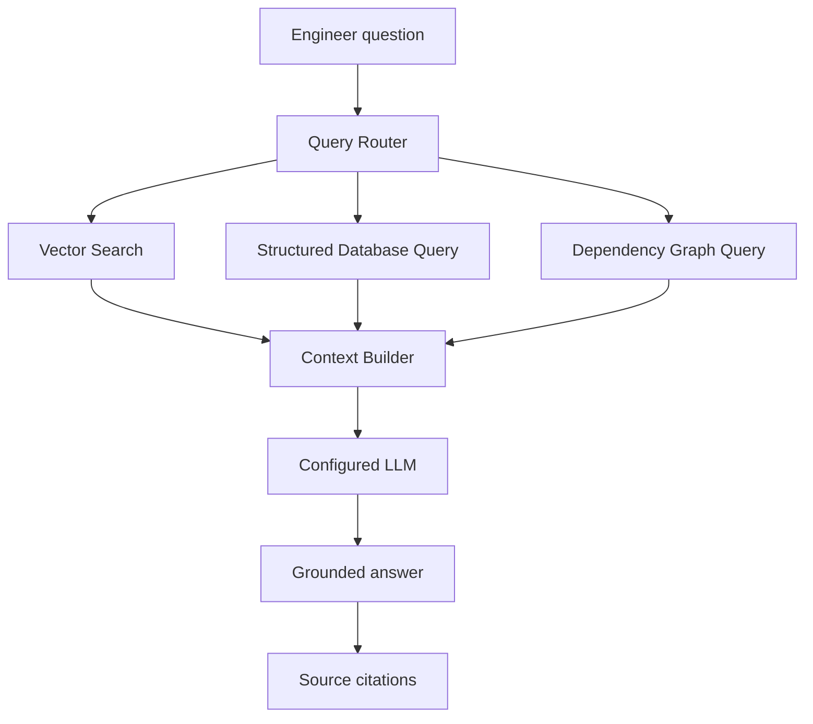

# STACKSENSE architecture

## Frontend

The React + TypeScript frontend is a Vite application with operational dashboards and a repository-scoped engineering assistant. The assistant keeps conversation state in the backend and renders returned evidence references as clickable source chips.

## Backend

The FastAPI backend is structured around routers, services, models, and configuration modules. The assistant route delegates to an AI service, which routes the question, retrieves evidence, builds a bounded context package, and calls a configured provider.

## Database

PostgreSQL is used as the persistence layer. SQLAlchemy handles database access and Alembic manages schema migrations. Knowledge documents currently store fixed-size local embeddings as JSON for SQLite test portability; the migration leaves room for pgvector acceleration when the extension is available.

## API layer

The API provides:

- GET /api/health
- GET /api/health/db
- POST /api/assistant/chat

The health routes return clean status payloads and use HTTP 503 for database outages.

## Docker

Docker Compose wires together the frontend, backend, and PostgreSQL database. PostgreSQL uses a persistent volume, and the backend runs migration commands before starting the API.

## Phase 5 RAG flow

The explicit index command creates chunked knowledge documents for code, commits, deployments, events, anomalies, incidents, root-cause analyses, and repository documentation. Incremental runs compare content hashes before re-embedding unchanged records. Retrieval always applies the selected `repository_id` filter and deduplicates source identities.

The local embedding provider is a deterministic hashing provider for development and tests. The local LLM provider summarizes only retrieved evidence and emits source markers; it returns uncertainty when evidence is absent. OpenAI-compatible HTTP providers can be configured through environment variables without placing credentials in source control.

## Future architecture direction

The following components are not implemented in Phase 1:

- Ingestion pipelines
- Code analysis services
- Dependency graph modeling
- Incident correlation workflows
- PostgreSQL pgvector-backed similarity acceleration
- Authentication and authorization around repository scopes
- Streaming assistant responses

## Productization

Requests receive an `X-Request-ID`, structured timing logs, security headers, and consistent JSON errors. `/api/metrics` exposes lightweight Prometheus-compatible counters, while `/api/health/system` reports API, database, model, embedding, and LLM dependency status without credentials.

Authentication is local-account based for the demo: passwords are scrypt-hashed, tokens are signed and expiring, and roles are `ADMIN`, `ENGINEER`, and `VIEWER`. Backend dependencies enforce permissions; the frontend only mirrors those permissions for navigation. Production uses the separate Compose file, a non-root API image, a multi-stage Nginx frontend image, persistent PostgreSQL storage, and health checks. OAuth, full organization membership, distributed metrics, background job queues, and high availability are intentionally outside this release.
